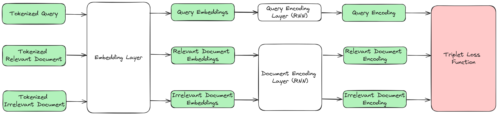

# Two-Tower Neural Network for Document Retrieval

## Overview

This project implements a **Two-Tower Neural Network** for **document retrieval**, using the **MS MARCO dataset**. The model is designed to take in a **query** and return the most **relevant documents**, leveraging deep learning techniques.

### Architecture

The Two-Tower architecture consists of:

- **Query Encoder Tower**: Processes the input search query and generates an embedding.
- **Document Encoder Tower**: Processes documents and generates embeddings.
- **Triplet Loss Training**: The model is trained using triplet loss to ensure that query embeddings are **closer** to relevant documents than to irrelevant ones.

  

---

## Project Workflow

1. **Dataset Preparation**

   - Load **MS MARCO v1.1** dataset from HuggingFace.
   - Preprocess and tokenize **queries and documents**.
   - Generate (Query, Relevant Document, Irrelevant Document) **triplets** using **negative sampling**.

2. **Model Architecture**

   - **Token Embedding Layer**: A pretrained word2vec-style embedding layer (can be frozen or fine-tuned).
   - **Two RNN-based Encoders**: One for **queries**, one for **documents** (both relevant and irrelevant).
   - **Distance Function**: Measures similarity between query and document embeddings.
   - **Triplet Loss Function**: Trains the model to minimize query-relevant document distance and maximize query-irrelevant document distance.

3. **Training & Optimization**

   - Train the encoders using **contrastive learning with triplet loss**.
   - Use **hard negative sampling** to improve retrieval performance.

4. **Inference Pipeline**
   - **Precompute document embeddings** and store them in a **vector database** (FAISS/Annoy).
   - Convert incoming **queries into embeddings**.
   - Compute similarity and **retrieve the top 5 most relevant documents**.

---

## Installation & Setup

### **Prerequisites**

TBD

### **Setup**

Clone the repository:

TBD
